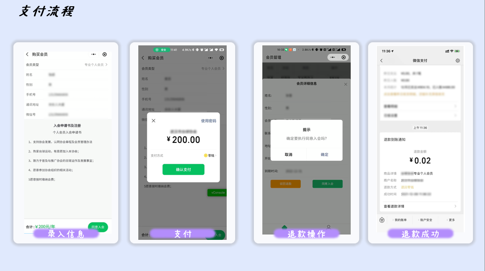
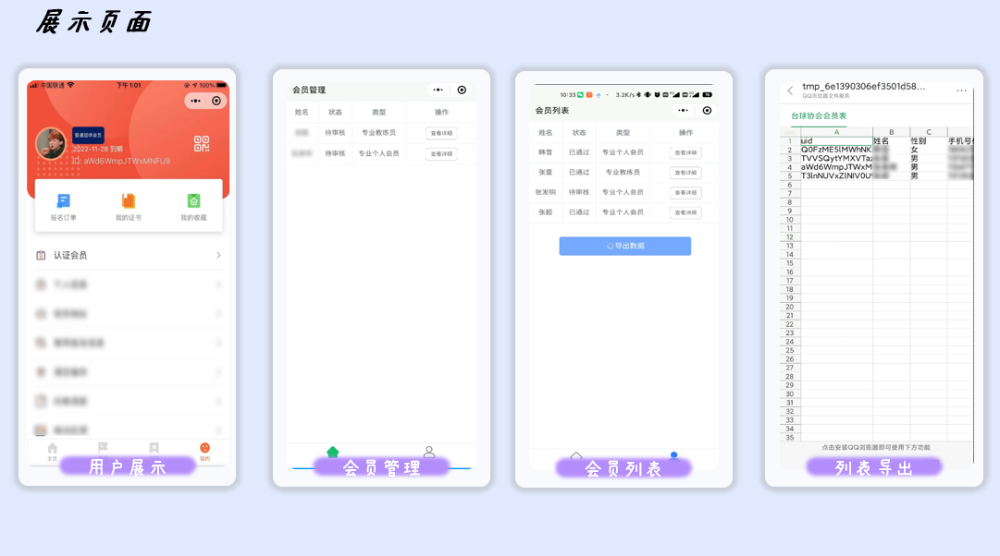

# 微信云开发实现微信支付

## 前言

> 之前帮朋友开发了一个小程序，会员体制的小程序，实现会员信息录入后购买 → 支付相应费用 → 后台审批 → 退款 or 同意入会，边学边做的，整理整理下核心代码。（测试小程序可能无法实现微信支付，我使用的是真实的商户号），现在简要梳理下
>
> 框架使用的是 wx-koa,和 koa 差不多
>
> 参考相关文档：
>
> [微信开放文档 (qq.com)](https://developers.weixin.qq.com/miniprogram/dev/wxcloud/basis/getting-started.html)
>
> [使用云函数+云调用，四步实现微信支付 - 掘金 (juejin.cn)](https://juejin.cn/post/6982508776888893454?searchId=20230814102424C5747B534366DED39C6F)

## **项目的需求如下：**

- [ ] 用户的基本信息必填（前端控制）
- [ ] 不同的会员对应不同的价格（后端返回会员列表）
- [ ] 用户购买操作
- [ ] 购买审核审核通过发放会员，不通过执行退款
- [ ] 会员列表简单导出功能





## 字段设计

这里创建了创建三个数据集合：`orderList（订单）`,`member（会员人员）`,`goodsList（会员价格表）`

**member 表字段如下**

| uid  | 姓名 | 性别 | 手机号码 | 会员类型 | 微信号       | 地址   | 过期时间  | 支付价格 | 价格  | 订单号      |
| ---- | ---- | ---- | -------- | -------- | ------------ | ------ | --------- | -------- | ----- | ----------- |
| uid  | name | sex  | phone    | type     | wechatNumber | adress | startTime | endTime  | price | orderNumber |

## 接口设计

| 接口路径              | 说明             | 备注 |
| --------------------- | ---------------- | ---- |
| /member/getMemberlist | 获取会员价格列表 |      |
| /member/getOrderlist  | 获取订单列表     |      |
| /member/getMemberInfo | 获取会员详情     |      |
| /member/pay           | 支付             |      |
| /member/paySuccess    | 支付成功         |      |
| /member/refund        | 退款             |      |
| /member/getMember     | 获取会员列表     |      |
| /member/updateMember  | 更新会员信息     |      |
| /member/exportExcel   | 导出 excel       |      |

## 代码部分

### 工具类函数

```js
// 其他更多是格式化有如下:
// yyyy:mm:dd|yyyy:mm|yyyy年mm月dd日|yyyy年mm月dd日 hh时MM分等,可自定义组合
function timeFormat(dateTime = null, fmt = "yyyy-mm-dd") {
  // 如果为null,则格式化当前时间
  if (!dateTime) dateTime = Number(new Date());
  // 如果dateTime长度为10或者13，则为秒和毫秒的时间戳，如果超过13位，则为其他的时间格式
  if (dateTime.toString().length == 10) dateTime *= 1000;
  let date = new Date(dateTime);
  let ret;
  let opt = {
    "y+": date.getFullYear().toString(), // 年
    "m+": (date.getMonth() + 1).toString(), // 月
    "d+": date.getDate().toString(), // 日
    "h+": date.getHours().toString(), // 时
    "M+": date.getMinutes().toString(), // 分
    "s+": date.getSeconds().toString(), // 秒
    // 有其他格式化字符需求可以继续添加，必须转化成字符串
  };
  for (let k in opt) {
    ret = new RegExp("(" + k + ")").exec(fmt);
    if (ret) {
      fmt = fmt.replace(ret[1], ret[1].length == 1 ? opt[k] : opt[k].padStart(ret[1].length, "0"));
    }
  }
  return fmt;
}
/**
 *判断是否过期
 * @param {String} start  输入结束时间
 * @returns
 */
function getStaus(start) {
  let a = (Date.parse(start) - Date.parse(timeFormat(null, "yyyy-mm-dd"))) / (24 * 60 * 60 * 1000);

  if (a > 0) {
    return {
      status: true,
      remainDay: a,
    };
  } else {
    return {
      status: false,
      remainDay: a,
    };
  }
}
/**
 * 增加一年函数
 * @param {String} time 输入时间
 * @param {Number} n 增加的年数
 */
function addYear(time, n = 1) {
  var d1 = new Date(time);
  var d2 = new Date(d1);
  d2.setFullYear(d2.getFullYear() + n);

  return timeFormat(d2, "yyyy-mm-dd");
}
```

### **getMemberInfo** 获取会员详情

```js
 async getMemberInfo(ctx, next) {
    let res = await ctx.db
      .collection("member")
      .where({ openid: ctx.OPENID })
      .field({
        openid: false,
      })
      .get();
    let target = res.data[0] || null;

    if (target) {
      target = {
        ...target,
        ...getStaus(target.endTime),
      };
      ctx.body = target;
    } else {
      console.log("新用户注册");
      return (ctx.body = {
        success: true,
        message: "查询成功",

        code: 200,
        data: {
          msg2: "新用户注册",
          type: "普通会员",
          status: false,
          remainDay: 0,
        },
      });
    }
  }
```

### 发起微信支付

```js
  async pay(ctx, next) {
    //
    let { text, price, priceType } = ctx.req.body;
    if (!text || !price || !priceType) {
      throw new TypeError("字段不完整");
    }
    console.log(text, price, priceType);
    const outTradeNo = "member_" + timeFormat(null, "yyyymmddhhMM") + Date.now();
    const res = await cloud.cloudPay.unifiedOrder({
      body: "xxx协会" + text, // 商品名称
      outTradeNo: outTradeNo, // 商户订单号
      spbillCreateIp: "127.0.0.1", // 这里填调用云函数的ip地址
      subMchId: "1xxx44xx96", // 子商户号
      totalFee: parseInt(price) * 100,
      envId: "xxxxxxxxxx", //云开发环境id
      functionName: "pay_cb",
    });
    res.orderNumber = outTradeNo;
    ctx.body = {
      success: true,
      message: "请求支付成功",
      code: 200,
      data: res,
    };
  }
```

### 支付成功

```js
  //  返回用户的订单号 用户uid
  async paySuccess(ctx, next) {
    //   获取用户是否存
    let body = ctx.req.body;
    let orderData = {
      ...body,
      time: new Date(),
      openid: ctx.OPENID,
    };
    //   支付成功存入订单列表
    await orderAdd(ctx.db, orderData);
    let { text, price, orderNumber, uid, code, name, sex, phone, adress, wechatNumber } = ctx.req.body;
    // 判断会员类型
    if (!text || !price || !orderNumber) {
      throw new TypeError("字段不完整");
    }

    let res = await ctx.db.collection("member").where({ openid: ctx.OPENID }).get();
    let target = res.data[0] || null;
    let status, result;

    if (target) {
      status = getStaus(target.endTime);
      console.log(status, "状态,续费");
      //   status = status.status;
    }

    if (status && status.status) {
      console.log("你已经是会员了");
     // 已经是会员加1年
      result = await ctx.db
        .collection("member")
        .doc(target._id)
        .update({
          data: {
            endTime: addYear(target.endTime),
            orderNumber,
          },
        });
    } else {
      //   会员已过期 新注册
      let curTime = timeFormat(null, "yyyy-mm-dd");
      let data = {
        uid: uid,
        openid: ctx.OPENID,
        endTime: addYear(curTime),
        orderNumber: orderNumber,
        price: price,
        startTime: curTime,
        type: text,
        code,
        name,
        sex,
        phone,
        adress,
        wechatNumber,
      };
      if (!target) {
        console.log("新用户注册");
        result = await memberAdd(ctx.db, data);
      } else {
        console.log("老用户更新");
        result = await ctx.db.collection("member").doc(target._id).update({
          data,
        });
      }
    }
    ctx.body = {
      success: true,
      message: "购买成功!",
      code: 200,
      data: result,
    };
  }
```

### 会员信息更新

```js
  //  更新会员信息 _id,code:false
  async updateMember(ctx, next) {
    let data = ctx.req.body;
    let id = data._id;
    delete data._id;
    let res = await ctx.db.collection("member").doc(id).update({
      data,
    });

    ctx.body = {
      success: true,
      message: "更新会员信息成功",
      code: 200,
      data: res,
    };
  }
```

### 退款

```js
// 退款操作
  async refund(ctx, next) {
    let { orderNumber, _id } = ctx.req.body;
    // 查询订单信息
    let datas = {
      out_trade_no: orderNumber, //商户订单号
      nonce_str: "" + new Date().getTime(), //随机字符串，这里也是采用时间戳精确到毫秒，人家要我们传随机字符串，我们就这么给他一个吧
      sub_mch_id: "1xxx44xx96", //子商户号，也就是商户号啦，没区别的
    };

    const { totalFee } = await cloud.cloudPay.queryOrder({ ...datas });

    let data = {
      out_refund_no: orderNumber + "-refund", // 退款订单号
      out_trade_no: orderNumber, // 付款订单号
      nonce_str: "95154sqwe", // 随机字符串
      subMchId: "1xxx44xx96",
      refund_fee: totalFee,
      total_fee: totalFee,
    };
    //   开始退款
    const res = await cloud.cloudPay.refund({
      ...data,
    });
    if (res.returnCode != "FAIL") {

      let refundDate = {
        ...data,
        typeCode: "退款",
      };
      await orderAdd(ctx.db, refundDate);

      let res2 = await ctx.db.collection("member").doc(_id).remove();
      console.log(res2, "移除数据");

      ctx.body = {
        success: true,
        message: "申请退款成功!",
        code: 200,
        data: res,
      };
    } else {
      ctx.body = {
        success: false,
        message: res.returnMsg || "退款失败",
        code: 200,
        data: res,
      };
    }
  }
```

### 导出 excel

这里使用了`node-xlsx`库,将构建好的 excel 存储到云存储，返回文件名，小程序端直接调用。

当时为了偷懒，其实可以新建一张表，存储导出记录和文件路径，这样严谨一点。

```js
async exportExcel(ctx, next) {
    const xlsx = require("node-xlsx");
    let jsonData = [];
    let data1 = [];
    const { total } = await ctx.db.collection("member").count();
    for (let i = 0; i < total; i++) {
      await ctx.db
        .collection("member")
        .skip(i)
        .limit(1)
        .get()
        .then((res) => {
          if (i != 0) {
            jsonData = jsonData.concat(res.data);
          } else {
            jsonData = res.data;
          }
        });
    }
    let header = ["uid", "姓名", "性别", "手机号码", "会员类型", "微信号", "地址", "会员开始时间", "过期时间", "支付价格", "订单号"];
    data1.push(header);
    for (let sample of jsonData) {
      let { uid, name, sex, phone, type, wechatNumber, adress, startTime, endTime, price, orderNumber } = sample;
      data1.push([uid, name, sex, phone, type, wechatNumber, adress, startTime, endTime, price, orderNumber]);
    }

    //    daoc
    let sheetName = "member/" + new Date().getTime() + ".xlsx";
    const options = {
      "!cols": [
        { wpx: 100 }, //1-    uid,
        { wpx: 50 }, //2-    name,
        { wpx: 50 }, //3-    sex,
        { wpx: 100 }, //4-    phone,
        { wpx: 80 }, //5-    type,
        { wpx: 100 }, //6-    wechatNumber,
        { wpx: 250 }, //7    adress,
        { wpx: 100 }, //8-    startTime,
        { wpx: 80 }, //9-    endTime,
        { wpx: 80 }, //10-    price,
        { wpx: 300 }, //10-    price,
      ],
    };
    var buffer = await xlsx.build([{ name: "XX协会会员表", data: data1 }], options);
    await cloud.uploadFile({
      cloudPath: sheetName,
      fileContent: buffer, //excel二进制文件
    });
    ctx.body = {
      success: true,
      message: "处理文件成功!",
      code: 200,
      data: {
        url: sheetName,
      },
    };
  }
```
